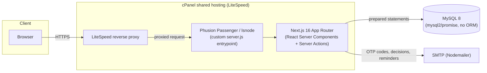
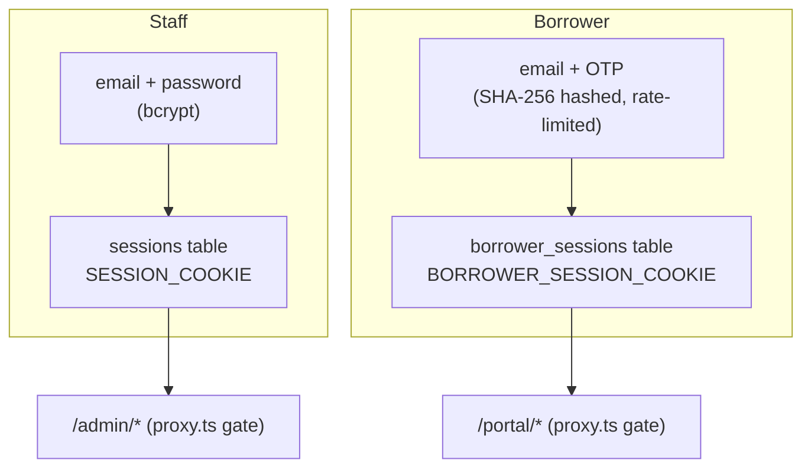
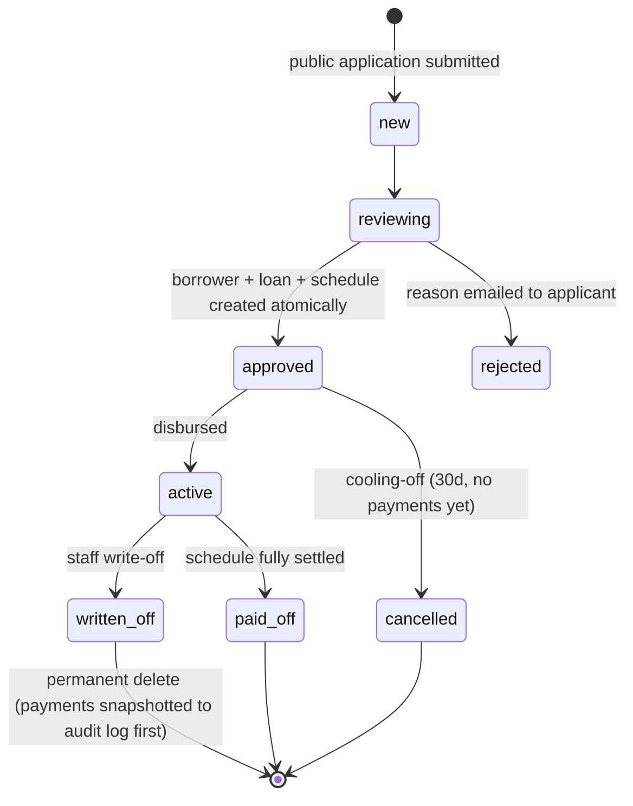

# Cham Business — Loan Origination & Servicing Platform

<p align="center">
  <strong>A production loan-origination and servicing platform for a licensed Rwandan non-deposit lender —
  built solo, self-hosted, and engineered to a real financial services regulation.</strong>
</p>

<p align="center">
  <a href="https://chambusiness.org"></a>
  
  
  
  
  
</p>

---

## What this is

Cham Business Ltd is a licensed non-deposit lender operating in Rwanda. This repository is the
full system behind it: a public marketing site, a loan application pipeline, a staff back-office,
and a self-service borrower portal — running in production, processing real loan applications and
real repayments.

It's built and maintained by one engineer, end to end: product decisions, database design,
backend logic, UI, deployment, and — notably — translating a 111-article national financial
regulation into working, enforced code. That last part is the part I'm proudest of, and it's
covered in its own section below.

**This is not a toy CRUD app.** It's a real financial system with money movement, regulatory
constraints, borrower-facing legal disclosures, and production incidents that got debugged and
fixed live. The [Notable engineering](#notable-engineering) section below is the honest version of
what that looked like.

## Table of contents

- [Feature tour](#feature-tour)
- [Regulatory compliance engineering](#regulatory-compliance-engineering)
- [Architecture](#architecture)
- [Data model](#data-model)
- [Tech stack](#tech-stack)
- [Notable engineering](#notable-engineering)
- [Project structure](#project-structure)
- [Running it locally](#running-it-locally)
- [Deployment](#deployment)
- [Security](#security)
- [License](#license)

---

## Feature tour

### Public site
Marketing pages, loan product catalog, an interest-rate explainer with a worked example, and a
multi-step public application form — capped at collecting only what's needed up front, with
everything else moved behind an OTP-verified identity (see below).

### Staff back-office (`/admin`)
- **Applications** — review, approve (spins up a borrower + loan + amortization schedule
  atomically), or reject with a reason (emailed to the applicant automatically).
- **Loans** — reducing-balance amortization schedules, mid-term restructuring (recomputes the
  outstanding balance over a new term while leaving paid instalments untouched), write-off, and a
  cooling-off cancellation window.
- **Payments** — MTN/Airtel/bank repayments, with a delete-and-recompute path that safely replays
  the remaining payment history if a historical entry is corrected or removed.
- **Borrowers, Guarantors, Collateral** — full profile management, including guarantor contracts
  and a collateral register/deregister lifecycle.
- **Accounting & Analytics** — portfolio totals, collection rate, overdue trend charts (Recharts),
  CSV export.
- **Complaints** — a dedicated queue, separate from payment disputes, for anything a borrower
  wants to raise.
- **Audit log** — every mutating staff action is recorded with a before/after detail payload.
- **Two-tier archive/delete** — soft-archive (reversible) vs. permanent delete (blocked or gated
  behind safety rules per entity — e.g. a loan can only be hard-deleted once written off, and
  deleting it snapshots every payment it had into the audit log first).

### Borrower self-service portal (`/portal`)
Passwordless, OTP-based login (no password to leak, no password to forget) on a session domain
completely separate from staff auth. Borrowers can finish their own KYC details, upload documents,
track their loan and schedule, submit payment proof (reviewed by staff before it ever touches the
ledger), and file a complaint.

---

## Regulatory compliance engineering

The part that makes this repo worth reading if you're evaluating engineering judgment, not just
CRUD throughput.

Rwanda's central bank (BNR) publishes **Regulation N° 55/2022** — 111 articles governing how
lenders must treat consumers: pricing transparency, contract disclosures, fair debt recovery,
over-indebtedness protection, and (the interesting one) the **in duplum rule** — a legal cap
saying accrued interest and penalties on a debt can never exceed its outstanding principal.

I read the regulation, mapped it against this codebase, and closed the gaps as real, enforced
system behavior — not a policy document sitting in a drawer:

| Regulation requirement | How it's enforced in code |
|---|---|
| In duplum rule (interest/penalties capped at outstanding principal) | [`lib/penalties.ts`](lib/penalties.ts) computes outstanding principal and existing penalties inside a transaction and **silently clamps** any new penalty to whatever headroom remains — the cap can't be bypassed by a race or a careless staff action |
| Penalties computed only on overdue principal, never compounded | Penalty ledger is a separate, auditable table (`loan_penalties`) rather than a mutable rate applied to a running balance |
| Loan decision + reason communicated promptly | Approval/rejection triggers an email automatically ([`lib/mailer.ts`](lib/mailer.ts)), including the staff-entered reason on rejection |
| Protection against over-indebtedness | [`lib/underwriting.ts`](lib/underwriting.ts) computes a debt-to-income ratio at approval time and surfaces a warning staff must explicitly override |
| Cooling-off cancellation | A loan can be cancelled penalty-free within 30 days, but only before any repayment has been made — enforced server-side, not just a UI affordance |
| Guarantor disclosure + release notice | Guarantors get a distinct record with a repayment-notification timestamp, auto-emailed the moment their loan reaches paid-off status |
| Collateral registration/deregistration | Tracked as its own lifecycle with a staff reminder banner once a loan is settled but collateral is still registered |
| Formal complaints channel | A first-class `complaints` table and queue, deliberately separate from payment disputes, reachable from both the staff console and the borrower portal |
| Standard contract terms, key facts statement, service charter | Published as their own routes (`/contract-template`, `/service-charter`), and a `KeyFactsStatement` component surfaced on every loan view |

This required reading primary-source legal text, extracting testable requirements from legal
prose, and deciding *how* to encode "the cap can't be bypassed" as an actual invariant rather than
a form validation.

---

## Architecture



Two independent auth/session domains run side by side in the same app:



A loan's lifecycle, including the states this project's compliance work added:



---

## Data model

17 tables, no ORM — hand-written SQL via `mysql2/promise`, wrapped in explicit transactions
(`withTransaction`) for every multi-statement mutation.

| Domain | Tables |
|---|---|
| Staff auth | `staff`, `sessions`, `password_reset_tokens` |
| Borrower auth | `otp_codes`, `borrower_sessions` |
| Origination | `applications`, `application_documents`, `borrowers` |
| Servicing | `loans`, `repayment_schedule`, `payments`, `payment_proofs` |
| Consumer protection | `loan_penalties`, `guarantors`, `loan_collateral`, `complaints` |
| Governance | `audit_log` |

Every table with a lifecycle (applications, borrowers, loans, payments) carries an `archived_at`
column for reversible soft-delete, separate from the guarded permanent-delete path.

## Tech stack

| Layer | Choice | Why |
|---|---|---|
| Framework | Next.js 16 (App Router, React 19) | Server Components + Server Actions collapse the API layer — no separate REST/GraphQL surface to maintain |
| Language | TypeScript, strict | End-to-end type safety from SQL row mapping to form validation |
| Database | MySQL 8 via `mysql2/promise` | No ORM — direct control over transactions and query shape on a cost-constrained shared-hosting DB |
| Validation | Zod | One schema shared between client-side `react-hook-form` and server-side re-validation |
| Email | Nodemailer | OTP codes, decision notices, overdue reminders, guarantor release notices |
| Charts | Recharts | Portfolio/collection analytics |
| Styling | Tailwind CSS v4 | Design tokens via the `@theme` block in `globals.css` |
| Hosting | cPanel shared hosting, LiteSpeed + Phusion Passenger (`lsnode`) | Real-world constraint: no Docker, no Vercel, a CPU/process-limited CloudLinux LVE environment |

---

## Notable engineering

Things that were genuinely hard, in the order I hit them:

- **Shared-hosting deployment under a process/CPU limit.** cPanel's Node.js hosting runs on
  CloudLinux LVE with hard process-count limits. Next's default build concurrency
  over-provisioned workers and crashed with `pthread_create: Resource temporarily unavailable`.
  Fixed by capping `experimental.cpus` in `next.config.ts` and writing a custom
  [`server.js`](server.js) entrypoint (Passenger expects a listener, not the `next start` CLI).
- **Environment variables silently not reaching request handlers.** Next.js's worker-process model
  means code loaded at server boot doesn't share env vars with the workers that actually handle
  requests. Traced and fixed by loading `.env.local` at the *point of use* in each of `lib/db.ts`,
  `lib/mailer.ts`, and `server.js` independently, rather than assuming a single top-level load
  would propagate.
- **A reverse-proxy host-header bug that broke HTTPS redirects.** LiteSpeed rewrites the `Host`
  header to the internal backend address before the Node process ever sees it, so an HTTPS-enforcing
  middleware built against `req.nextUrl.host` silently redirected every visitor to
  `https://localhost:3000`. Diagnosed with raw `curl -I`, fixed by reading `x-forwarded-host`
  instead — see [`proxy.ts`](proxy.ts).
- **Recomputing a loan schedule after a historical payment is edited or deleted.** Payments
  allocate oldest-instalment-first; deleting one from the middle of the history invalidates every
  allocation after it. `recomputeLoanScheduleFromPayments` (in `lib/loans.ts`) resets the schedule
  and replays every remaining payment in chronological order rather than patching state in place.
- **Encoding a legal invariant (in duplum) as code that can't be bypassed**, covered above.

---

## Project structure

```
app/
  (public)/          marketing site, apply form, contract-template, service-charter
  admin/             staff back-office (protected by proxy.ts)
  portal/            borrower self-service portal (separate auth domain)
  actions/           Server Actions -- one file per domain, thin: validate -> call lib -> revalidate
  api/               a few routes that can't be Server Actions (file downloads, cron, public POSTs)
lib/                 all business logic + DB access; one module per domain, no ORM
components/
  admin/             admin-only UI
  portal/            borrower-only UI
  *.tsx              shared/public site components
db/
  schema.sql          canonical fresh-install schema
  migration-*.sql     one-off ALTER/CREATE scripts actually run against the live DB
scripts/
  seed-admin.mjs      CLI to create/reset a staff account
```

## Running it locally

```bash
npm install
cp .env.local.example .env.local   # fill in DB + SMTP credentials
npm run dev
```

Needs a MySQL instance with `db/schema.sql` applied, plus every migration in `db/migration-*.sql`
in filename order. Environment variables required (see `lib/db.ts` / `lib/mailer.ts` /
`lib/crypto.ts`): `DB_HOST`, `DB_PORT`, `DB_NAME`, `DB_USER`, `DB_PASSWORD`, `SMTP_HOST`,
`SMTP_PORT`, `SMTP_USER`, `SMTP_PASSWORD`, `SMTP_FROM`, `ENCRYPTION_KEY`, `APP_URL`.

```bash
npm run build   # production build (webpack, not Turbopack -- see next.config.ts)
npm run start   # serve the production build
```

No test runner is configured yet — noted honestly rather than papered over with a badge that
doesn't mean anything.

## Deployment

Runs on cPanel shared hosting behind LiteSpeed, via Phusion Passenger's Node.js App support
(`lsnode`). Deploys are `git pull` + `npm run build` + killing the running `lsnode` process so
Passenger respawns it on the next request — see [Notable engineering](#notable-engineering) for
why that's non-trivial on this stack.

## Security

- Staff passwords hashed with bcrypt; borrowers authenticate passwordlessly via rate-limited,
  SHA-256-hashed one-time codes — nothing to leak in a breach because there's no password to steal.
- National ID numbers encrypted at rest (`lib/crypto.ts`); never logged, never included in
  audit-log detail payloads.
- All queries are parameterized (`mysql2` placeholders) — no string-built SQL.
- Uploaded documents are stored outside the web root and served only through an authenticated
  route handler, never as static files.
- Every mutating action writes an audit-log row with a before/after detail payload.
- HTTPS enforced at the application layer as defense-in-depth on top of the host's TLS termination.

## License

Proprietary — © Cham Business Ltd. This is closed-source software built for a live lending
business; it's shared here to demonstrate engineering work, not for reuse, redistribution, or
derivative deployment. See [`LICENSE`](LICENSE).

---

<p align="center">Built and operated solo. Questions about the engineering? Open an issue or reach out.</p>
